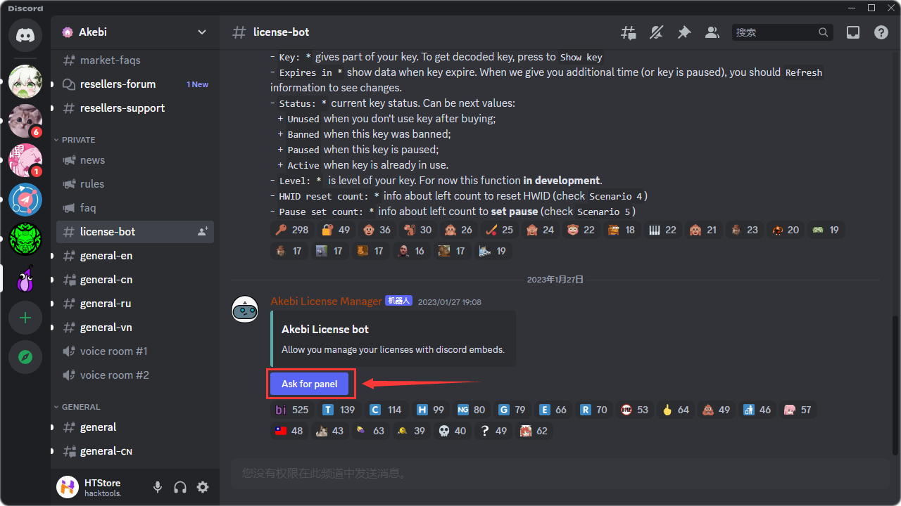
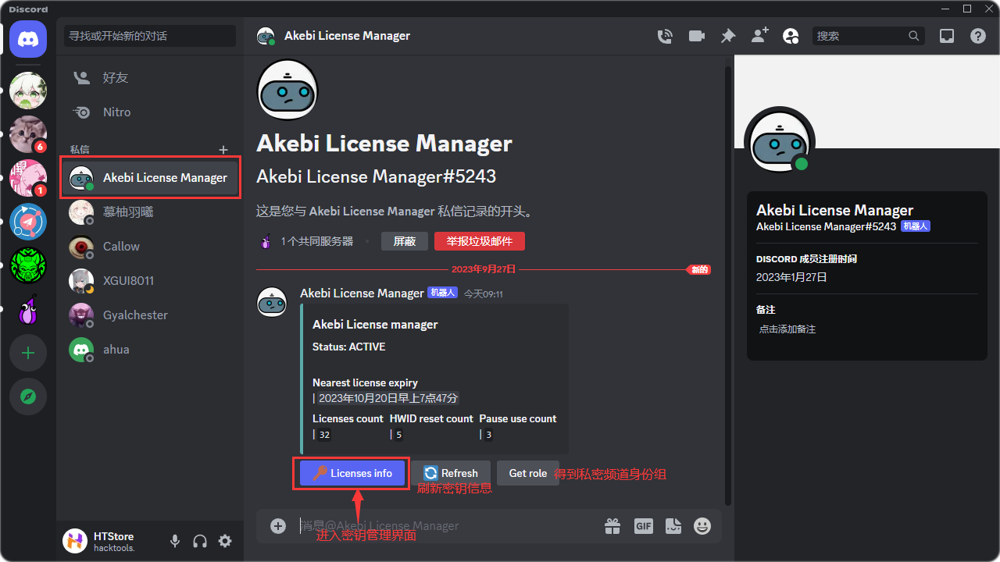
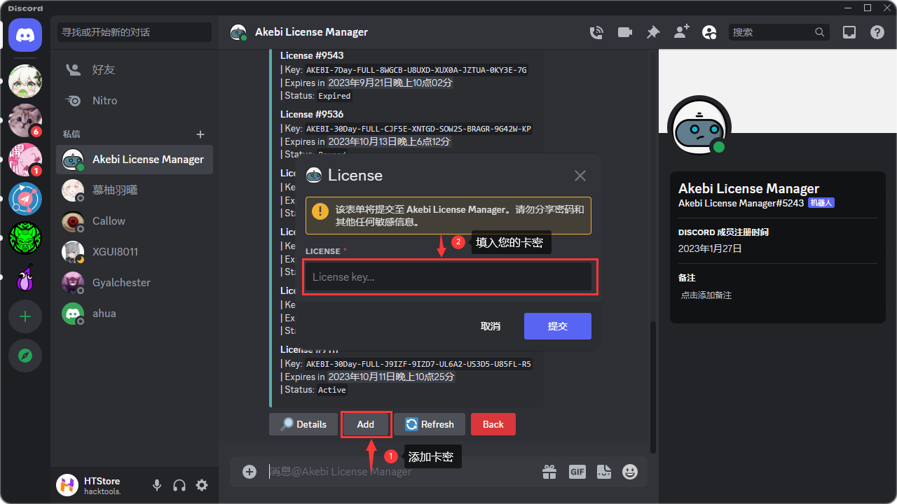
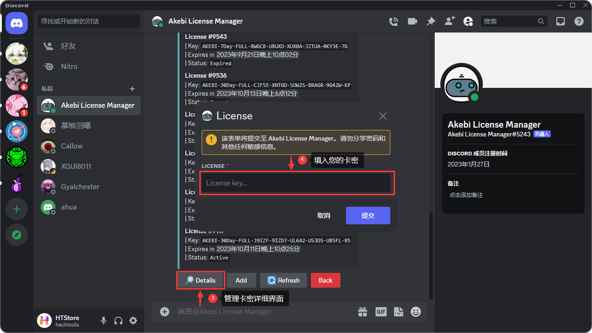
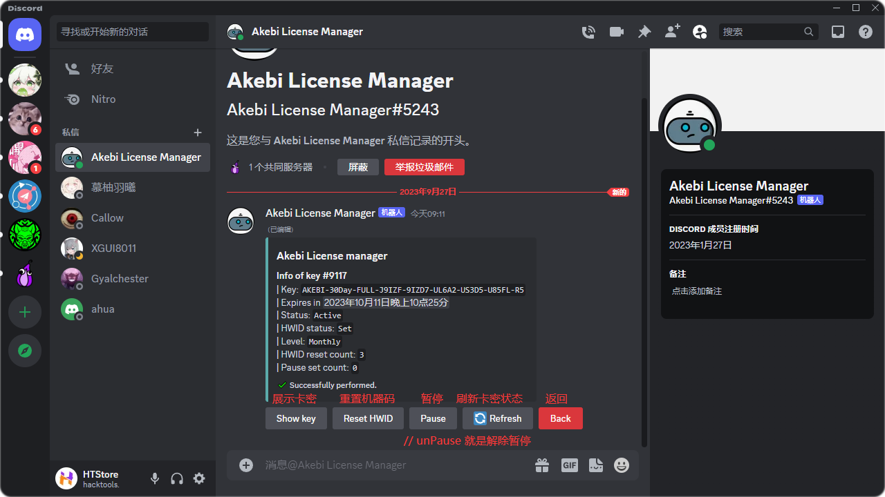

# 密钥管理

<head>
  <meta charset="utf-8" />
  <meta name="description" content="Akebi 官方教程(原Akebi-GC/Acrepi)，最全面的 Akebi 中文参考文档。"/>
  <meta name="keywords" content="Akebi,Akebi-GC,Akebi教程"/>
  <meta name="author" content="Akebi,Akebi-GC,Acrepi"/>
</head>

:::tip

日卡、周卡、月卡分别可以换绑一、一、三次。仅月卡可以暂停一次。**`凡是在 SCRkit 购买的同学可联系管理员处理。`**

:::

# 绑定至 Discord 账号
> 至此，你应该已经获取到了你的 Akebi 密钥。接下来，你需要将其绑定在自己的 [**`Discord`**](https://discord.com/) 账号上。  
 
 
在 **`Discord`** 绑定密钥并不会因此开始计时。  

* Discord 需要 `允许服务器成员直接向您发起私聊` 处于启用状态。  
* Akebi 社群链接 [`https://discord.com/invite/akebi`](https://discord.com/invite/akebi)
* 进入社群后，切记记住不要在 `generel-trap-chanel` 频道发言，否则您会被 Akebi 踢出并永久拉黑。  
  
*公告解释道，这是一项反机器人的措施，有些人总被坏比骗过去发言导致被拉黑，但你绑定卡密后就免除被拉黑的风险。*

## 唤醒机器人

在 `Akebi Discord` 服务器 中，在 `PRIVATE` 类别找到并进入 `#license-bot` 频道，点击里面的 `Ask for panel` 按钮。  



**这时候会从聊天栏弹出来机器人的头像**

## 使用机器人



### 添加卡密

点击 `Akebi Lincense Manager` 中的 `Add` 按钮即可添加卡密。  

添加密钥之后你将自动获得 `Insider` 身份组，以查看内部频道来获取更新资讯和讨论功能。请注意，它只能持续到你的所有密钥结束。

### 管理界面

点击 `Akebi Lincense Manager` 中的 `Details` 按钮并输入卡密即可打开管理界面 *(前提是你添加了卡密)*。  


### Details 界面注解

```
- Key: * 展示您目前操控的卡密。
- Expires in * 显示您的卡密何时到期，如果您暂停了，则需要点击 `Refresh` 查看新的日期。
- Status: * 展示您的卡密状态:
   + Unused 您买了却没有使用的时候。
   + Banned 您的卡密被禁用的时候。
   + Paused 您的卡密被暂停的时候。
   + Active 您的卡密正在使用的时候。
   + Expired 您的卡密已经过期的时候。
- Level: *  显示您的卡密是天卡、周卡还是月卡。
- HWID reset count: * 显示您的卡密剩余换绑的次数。
- Pause set count: * 显示您的卡密剩余的暂停次数。
```

### 解除绑定 (HWID/机器码)

如果需要更换电脑，则需要重置 HWID。
* 点击 `Reset HWID` 即可重置此卡密的 HWID。

### 暫停卡密

如果你暂时一段时间不会使用 Akebi，你可以选择暂停密钥时间。请注意，只有 1 次暂停机会。
* 点击 `Pause` 即可暂停此卡密的时间。如需恢复，则需要点击 `Unpause` 。`只有月卡用户才会显示此按钮。`